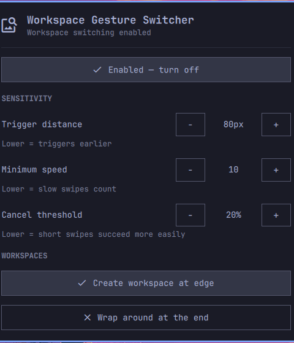

# Workspace Gesture Switcher

A compact Omarchy bar widget for configuring a three-finger horizontal swipe
to switch Hyprland workspaces.

It is designed especially for people moving from macOS to Omarchy: the goal is
to make the familiar trackpad-based workspace workflow easy to discover, tune,
and turn on or off without editing Hyprland configuration by hand.



## Features

- Enable or disable the three-finger workspace gesture from the top bar.
- Tune trigger distance, minimum swipe speed, and cancel threshold.
- Choose whether a swipe at the edge creates a new workspace.
- Optionally wrap from the last workspace back to the first.
- Apply changes immediately and validate the Hyprland configuration after each
  update.

## Requirements

- Omarchy with its Quickshell bar.
- Hyprland 0.55 or newer (Lua configuration support).
- A touchpad that exposes three-finger swipes through libinput.

## Install

Once this repository is published on GitHub, install it with Omarchy:

```bash
omarchy plugin add https://github.com/YOUR-USERNAME/workspace-gesture-switcher.git --enable
```

Or install it manually while developing:

```bash
git clone https://github.com/YOUR-USERNAME/workspace-gesture-switcher.git \
  ~/.config/omarchy/plugins/workspace-gesture-switcher
omarchy plugin enable workspace-gesture-switcher right
```

Click the gesture icon in the right side of the top bar to open the panel.

## What the controls mean

| Control | Effect |
| --- | --- |
| Trigger distance | Lower values make a workspace change trigger with less travel. |
| Minimum speed | Lower values allow slower swipes to complete. |
| Cancel threshold | Lower values make short swipes less likely to be cancelled. |
| Create workspace at edge | Swiping past the final workspace creates a new one. |
| Wrap around at the end | Swiping past the final workspace returns to the first. |

The widget controls Hyprland's workspace-swipe settings. Gesture recognition
itself begins in libinput, so hardware-specific finger-detection latency cannot
always be eliminated by compositor settings alone.

## Development

Validate the plugin after changes:

```bash
omarchy plugin validate .
```

Reload the bar without logging out:

```bash
omarchy-shell shell rescanPlugins
```

## License

MIT. See [LICENSE](LICENSE).
