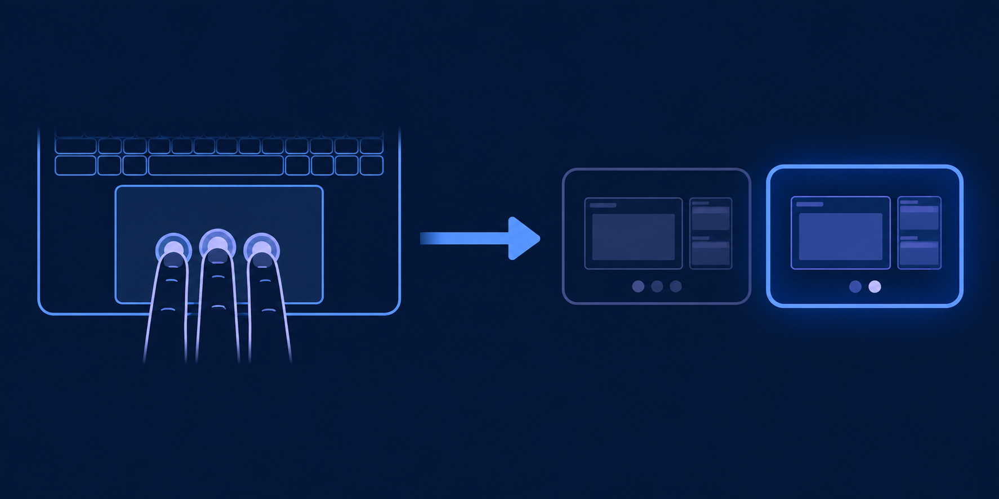

# Workspace Gesture Switcher

A compact Omarchy bar widget for configuring a three-finger horizontal swipe
to switch Hyprland workspaces.

It is designed especially for people moving from macOS to Omarchy: the goal is
to make the familiar trackpad-based workspace workflow easy to discover, tune,
and turn on or off without editing Hyprland configuration by hand.

## Quick start — one required click after installation

1. Install and enable the plugin:

   ```bash
   omarchy plugin add https://github.com/alexanderpuschkinberlin/workspace-gesture-switcher.git --enable
   ```

2. Open **Workspace Gesture Switcher** from the right side of the top bar.
3. Click **Set up and enable**.

That explicit first click safely adds the required Hyprland configuration.
Nothing else needs to be installed or configured manually. A one-time backup
of `~/.config/hypr/input.lua` is created before the plugin changes it.


## How it works

Place three fingers on the trackpad and swipe horizontally. The gesture moves
the active workspace in the direction of the swipe; the highlighted card in
the diagram represents the workspace that becomes active.



## Features

- Enable or disable the three-finger workspace gesture from the top bar.
- Tune trigger distance, minimum swipe speed, and cancel threshold.
- Choose whether a swipe at the edge creates a new workspace.
- Optionally wrap from the last workspace back to the first.
- Apply changes immediately and validate the Hyprland configuration after each
  update.
- Set itself up on the first activation: the plugin appends only its clearly
  marked configuration block to `~/.config/hypr/input.lua`.

## Requirements

- Omarchy with its Quickshell bar.
- Hyprland 0.55 or newer (Lua configuration support).
- A touchpad that exposes three-finger swipes through libinput.

No additional packages, root permissions, or manual Hyprland edits are needed
on a standard Omarchy installation.

## Install

Install it with Omarchy:

```bash
omarchy plugin add https://github.com/alexanderpuschkinberlin/workspace-gesture-switcher.git --enable
```

Or install it manually while developing:

```bash
git clone https://github.com/alexanderpuschkinberlin/workspace-gesture-switcher.git \
  ~/.config/omarchy/plugins/workspace-gesture-switcher
omarchy plugin enable workspace-gesture-switcher right
```

Click the gesture icon in the right side of the top bar to open the panel, then
select **Set up and enable**. On this explicit first activation the plugin
adds its managed block to `~/.config/hypr/input.lua`, keeps all other settings
unchanged, and creates a one-time backup beside it named
`input.lua.backup-workspace-gesture-switcher`. Every later change updates only
that marked block and is checked with `hyprctl configerrors`. If validation
fails, the plugin restores the previous file automatically.

## What the controls mean

| Control | Effect |
| --- | --- |
| Trigger distance | Lower values make a workspace change trigger with less travel. |
| Minimum speed | Lower values allow slower swipes to complete. |
| Cancel threshold | Lower values make short swipes less likely to be cancelled. |
| Create workspace at edge | Swiping past the final workspace creates a new one. |
| Wrap around at the end | Swiping past the final workspace returns to the first. |

The widget controls Hyprland's workspace-swipe settings. Gesture recognition
itself begins in libinput, so hardware-specific finger-detection latency cannot
always be eliminated by compositor settings alone.

## Development

Validate the plugin after changes:

```bash
omarchy plugin validate .
```

Reload the bar without logging out:

```bash
omarchy-shell shell rescanPlugins
```

## License

MIT. See [LICENSE](LICENSE).
